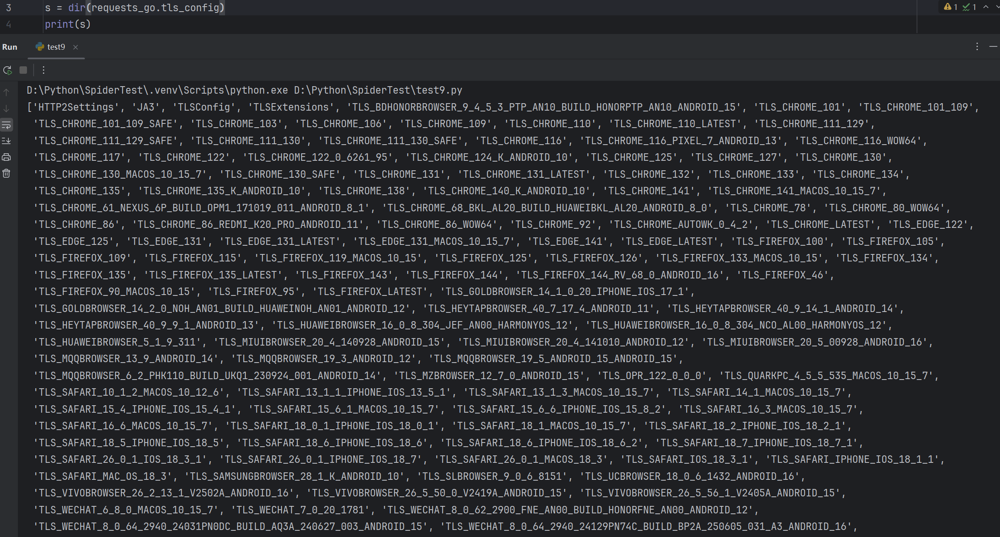

# Requests-Go: 终极HTTP请求库

**Requests-Go** 是一个为现代网络爬虫和自动化任务而生的、功能强大的Python HTTP客户端库。它巧妙地结合了Python `requests`库的易用性与Go语言底层网络栈的高性能和高可定制性，专门用于解决TLS指纹（如JA3/JA4）识别、HTTP/2自定义以及绕过高级机器人检测等难题。


## 核心特性

  - **动态TLS指纹模拟**: 内置多种主流浏览器（Chrome, Firefox, Safari, Edge）的TLS指纹配置，只需一行代码即可切换。
  - **JA3指纹随机化**: 模拟现代浏览器行为，自动随机化JA3指纹中的扩展（Extensions）部分，使每个请求都独一无二。
  - **HTTP/2 精准控制**: 完全掌控HTTP/2的`HEADERS`帧、`SETTINGS`帧、窗口更新（`WINDOW_UPDATE`）和优先级（`PRIORITY`）设置。
  - **JA4指纹支持**: 能够配置JA4所需的TLS和HTTP特性，以应对最前沿的指纹识别技术。
  - **异步支持**: 提供完整的异步接口 (`async`/`await`)，适用于高性能的并发场景。
  - **无缝兼容 `requests`**: API设计与业界标准的`requests`库保持一致，迁移成本极低。


## 安装

通过pip轻松安装：

```bash
pip install requests-go
```


## 加入微信群聊
如果你想跟更多志同道合的人一起学习，那么加入群聊来吧！(备注：加群)


## 获取付费版tls_config包
付费版的tls_config包内置300个指纹（后续会一直更新），各种浏览器和手机指纹（chrome，edge，firefox，safari，opera，ie，okhttp，reqable，各种第三方浏览器百度，小米，华为，vivo等），安装后无缝衔接requests-go，不需要任何操作，获取方式添加上方微信号。




## 快速上手

`requests-go`的使用体验与`requests`几乎完全相同。

```python
import requests_go as requests

# 将包重命名为requests即可享受与原生requests一致的编码体验
response = requests.get('https://httpbin.org/get', tls_config=requests.tls_config.TLS_CHROME_LATEST)
print(response.json())
```

仅仅是这样简单的替换，您的HTTP请求就已经拥有了Go语言的TLS指纹，这能帮助您轻松绕过许多仅针对Python默认指纹的防火墙。


## 核心概念：`tls_config`

`requests-go`所有高级功能的关键在于`tls_config`参数。这是一个`TLSConfig`对象，它允许你精细地调整TLS握手和HTTP/2通信的每一个细节。

你可以通过`requests_go.get()`、`requests_go.post()`或`Session`对象的方法传入此参数。

```python
import requests_go
from requests_go import tls_config

# 创建一个默认的TLS配置，默认没有ja3，需自己填写
conf = tls_config.TLSConfig()

# 自定义TLS配置，后续有讲解
conf.ja3 = "771,4865-4866-4867-49195-49199-49196-49200-52393-52392-49171-49172-156-157-47-53,16-18-5-27-0-13-11-43-45-35-51-23-10-65281-17513-21,29-23-24,0"
conf.pseudo_header_order = [
    ":method",
    ":authority",
    ":scheme",
    ":path",
]
conf.tls_extensions.cert_compression_algo = ["brotli"]
conf.tls_extensions.supported_signature_algorithms = [
    "ecdsa_secp256r1_sha256",
    "rsa_pss_rsae_sha256",
    "rsa_pkcs1_sha256",
    "ecdsa_secp384r1_sha384",
    "rsa_pss_rsae_sha384",
    "rsa_pkcs1_sha384",
    "rsa_pss_rsae_sha512",
    "rsa_pkcs1_sha512"
]
conf.tls_extensions.supported_versions = [
    "GREASE",
    "1.3",
    "1.2"
]
conf.tls_extensions.psk_key_exchange_modes = [
    "PskModeDHE"
]
conf.tls_extensions.key_share_curves = [
    "GREASE",
    "X25519"
]
conf.http2_settings.settings = {
    "HEADER_TABLE_SIZE": 65536,
    "ENABLE_PUSH": 0,
    "MAX_CONCURRENT_STREAMS": 1000,
    "INITIAL_WINDOW_SIZE": 6291456,
    "MAX_HEADER_LIST_SIZE": 262144
}
conf.http2_settings.settings_order = [
    "HEADER_TABLE_SIZE",
    "ENABLE_PUSH",
    "MAX_CONCURRENT_STREAMS",
    "INITIAL_WINDOW_SIZE",
    "MAX_HEADER_LIST_SIZE"
]
conf.http2_settings.connection_flow = 15663105

# 在请求中应用配置
url = "https://tls.peet.ws/api/all"
response = requests_go.get(url, tls_config=conf)
```


## TLS指纹模拟 (JA3 & JA4)


### 使用内置浏览器指纹

这是最简单、最推荐的方式。`requests-go`已经为您预设了多种浏览器的完整TLS和HTTP/2配置。

```python
import requests_go as requests
from requests_go.tls_config import TLS_CHROME_LATEST

# 使用内置的最新版Chrome浏览器指纹
response = requests.get(
    "https://tls.peet.ws/api/all",
    tls_config=TLS_CHROME_LATEST
)

print(response.json()['tls']['ja3'])

# session使用内置的最新版Chrome浏览器指纹
session = requests.Session()
session.tls_config = TLS_CHROME_LATEST
response = session.get(
    "https://tls.peet.ws/api/all"
)

print(response.json()['tls']['ja3'])
```

**可用的内置指纹包括：**

  - `TLS_CHROME_LATEST`, `TLS_CHROME_131_LATEST`, `TLS_CHROME_131`, `TLS_CHROME_130_SAFE`, `TLS_CHROME_130`, `TLS_CHROME_111_129_SAFE`, `TLS_CHROME_111_129`, `TLS_CHROME_122`, `TLS_CHROME_110`, `TLS_CHROME_110_LATEST`, `TLS_CHROME_103`, `TLS_CHROME_101`
  - `TLS_EDGE_LATEST`, `TLS_EDGE_131_LATEST`, `TLS_EDGE_131`
  - `TLS_FIREFOX_LATEST`, `TLS_FIREFOX_135_LATEST`, `TLS_FIREFOX_135`, `TLS_FIREFOX_134`, `TLS_FIREFOX_126`, `TLS_FIREFOX_105`
  - `TLS_SAFARI_MAC_OS_18_3`, `TLS_SAFARI_IOS_18_3_1`


### 自定义JA3指纹

你可以手动创建一个`TLSConfig`实例并设置其JA3指纹字符串。

```python
import requests_go as requests
from requests_go.tls_config import TLSConfig

# 创建自定义配置
custom_tls = TLSConfig()
custom_tls.ja3 = "771,4865-4866-4867-49195-49199-49196-49200-52393-52392-49171-49172-156-157-47-53,16-18-5-27-0-13-11-43-45-35-51-23-10-65281-17513-21,29-23-24,0"

# 重要：当自定义JA3时，通常需要一并设置伪标头顺序以确保HTTP/2请求成功
custom_tls.pseudo_header_order = [
    ":method",
    ":authority",
    ":scheme",
    ":path",
]

response = requests.get(url, tls_config=custom_tls)
```

### 常见问题

> **常见问题一**：单独设置`ja3`后请求返回404错误？
> 
> **解答**：这是因为默认使用HTTP/2协议，它要求正确的伪标头(`:method`, `:authority`等)顺序。请务必设置`pseudo_header_order`。如果目标网站不支持HTTP/2或你想强制使用HTTP/1.1，可以设置 `custom_tls.force_http1 = True`。

> **常见问题二**: 设置content-length发生错误？
> 
> **解答**: 不能自行设置content-length，否则会出现未知错误！

> **常见问题三**: 使用代理池为啥没更换IP？
> 
> **解答**: 因为连接复用默认是开启的，所以不会更换IP，想要更换IP就得关闭连接复用，在headers中添加`Connection: close`或者每次在代理中添加#号，比如：`http://127.0.0.1:7890#123`即可。

### JA3指纹随机化

现代浏览器会随机化TLS扩展（Extensions）的顺序来避免被指纹追踪。`requests-go`完美支持此功能。

设置`random_ja3`为`True`后，每次生成的JA3字符串中第三部分（extensions）的顺序都会改变，但构成元素不变。

```python
import requests_go as requests
from requests_go.tls_config import TLS_CHROME_LATEST

# 开启JA3随机化
TLS_CHROME_LATEST.random_ja3 = True

# 连续发起请求，你会发现每次的JA3指纹都不同
for _ in range(3):
    resp = requests.get("https://tls.peet.ws/api/all", tls_config=TLS_CHROME_LATEST)
    print(resp.json()['tls']['ja3'])
```


### 从浏览器生成配置

你可以通过浏览器访问[`https://tls.peet.ws/api/all`](https://tls.peet.ws/api/all)，将返回的JSON结果直接转换为`TLSConfig`对象。

```python
import requests_go as requests
from requests_go import tls_config


# 假设这是你从浏览器访问https://tls.peet.ws/api/all获取的JSON数据
browser_fingerprint_json = {
    "tls": {
        "ja3": "771,4865-4866-4867-49195-49199-49196-49200-52393-52392-49171-49172-156-157-47-53,0-23-65281-10-11-35-16-5-13-18-51-45-43-27-17513-21,29-23-24,0",
        # ... 其他TLS字段
    },
    "http2": {
        # ... HTTP/2相关字段
    }
    # ...
}

# 使用to_tls_config函数自动转换
tls_conf = tls_config.to_tls_config(browser_fingerprint_json)
url = "https://tls.peet.ws/api/all"
response = requests.get(url, tls_config=tls_conf)
print(response.text)
```


## HTTP/2 精细化控制

`TLSConfig`对象包含一个`http2_settings`属性，它是一个`HTTP2Settings`类的实例，允许你深入定制HTTP/2行为。


### `settings` 和 `settings_order`

控制HTTP/2 `SETTINGS`帧的内容和发送顺序。

```python
from requests_go.tls_config import TLSConfig

conf = TLSConfig()

# 设置SETTINGS帧的具体值
conf.http2_settings.settings = {
    "HEADER_TABLE_SIZE": 65536,
    "MAX_CONCURRENT_STREAMS": 1000,
    "INITIAL_WINDOW_SIZE": 6291456,
    "MAX_HEADER_LIST_SIZE": 262144
}

# 设定这些参数在SETTINGS帧中的出现顺序
conf.http2_settings.settings_order = [
    "HEADER_TABLE_SIZE",
    "MAX_CONCURRENT_STREAMS",
    "INITIAL_WINDOW_SIZE",
    "MAX_HEADER_LIST_SIZE"
]
```


### `connection_flow`

控制`WINDOW_UPDATE`帧的窗口大小增量，这是一个非常细微但重要的指纹特征。

```python
conf.http2_settings.connection_flow = 15663105  # 设置窗口更新增量
```


### `header_priority` 和 `priority_frames`

定义`HEADERS`帧和`PRIORITY`帧中的流依赖关系和权重，模拟浏览器复杂的资源加载优先级策略。

```python
# 设置默认的头部优先级
conf.http2_settings.header_priority = {
    "streamDep": 0,
    "exclusive": True,
    "weight": 256
}

# 定义一系列具体的PRIORITY帧（如果需要）
conf.http2_settings.priority_frames = [
  {
    "streamID": 3,
    "priorityParam": {
      "weight": 201,
      "streamDep": 0,
      "exclusive": False
    }
  },
  # ...更多PRIORITY帧
]
```


## TLS 扩展（Extensions）自定义

`TLSConfig`对象还包含一个`tls_extensions`属性，其实例为`TLSExtensions`类，用于配置TLS Client Hello包中的各项扩展。

### `supported_signature_algorithms`

  * **作用**: 定义客户端支持的签名算法列表。服务器会根据此列表选择合适的算法来验证证书链。
  * **可选值**:
      * 字符串形式的标准名称，例如：
          * `"ecdsa_secp256r1_sha256"`
          * `"rsa_pss_rsae_sha256"`
          * `"rsa_pkcs1_sha256"`
          * `"ecdsa_secp384r1_sha384"`
          * `"rsa_pss_rsae_sha384"`
          * `"rsa_pkcs1_sha384"`
          * `"ecdsa_secp521r1_sha512"`
          * `"rsa_pss_rsae_sha512"`
          * `"rsa_pkcs1_sha512"`
          * `"ed25519"`
      * 也可以使用十六进制值，例如：`"0x402"`。
  * **示例**:
    ```python
    conf.tls_extensions.supported_signature_algorithms = [
        "ecdsa_secp256r1_sha256",
        "rsa_pss_rsae_sha256",
        "rsa_pkcs1_sha256"
    ]
    ```

### `cert_compression_algo`

  * **作用**: 定义客户端支持的证书压缩算法。
  * **可选值**:
      * `"zlib"`
      * `"brotli"`
      * `"zstd"`
  * **示例**:
    ```python
    conf.tls_extensions.cert_compression_algo = ["brotli"]
    ```

### `record_size_limit`

  * **作用**: 定义TLS记录大小限制扩展的值。这是一个整数值。
  * **示例**:
    ```python
    conf.tls_extensions.record_size_limit = 4001
    ```

### `supported_delegated_credentials_algorithms`

  * **作用**: 定义支持的委托凭证算法。
  * **可选值**: 与`supported_signature_algorithms`类似，支持多种标准名称和十六进制值。
  * **示例**:
    ```python
    conf.tls_extensions.supported_delegated_credentials_algorithms = [
        "ECDSAWithP256AndSHA256",
        "ECDSAWithP384AndSHA384"
    ]
    ```

### `supported_versions`

  * **作用**: 定义客户端支持的TLS协议版本列表。
  * **可选值**:
      * `"GREASE"` (用于防止服务器对未知值的错误处理)
      * `"1.3"`
      * `"1.2"`
      * `"1.1"`
      * `"1.0"`
  * **示例**:
    ```python
    conf.tls_extensions.supported_versions = ["GREASE", "1.3", "1.2"]
    ```

### `psk_key_exchange_modes`

  * **作用**: 定义PSK（预共享密钥）的密钥交换模式。
  * **可选值**:
      * `"PskModeDHE"`
      * `"PskModePlain"`
  * **示例**:
    ```python
    conf.tls_extensions.psk_key_exchange_modes = ["PskModeDHE"]
    ```

### `signature_algorithms_cert`

  * **作用**: 定义证书签名所支持的算法。
  * **可选值**: 与`supported_signature_algorithms`类似，支持多种标准名称和十六进制值。
  * **示例**:
    ```python
    conf.tls_extensions.signature_algorithms_cert = [
        "ECDSAWithP256AndSHA256",
        "PSSWithSHA256"
    ]
    ```

### `key_share_curves`

  * **作用**: 定义客户端支持的密钥共享曲线（用于密钥交换）。
  * **可选值**:
      * `"GREASE"`
      * `"P256"`
      * `"P384"`
      * `"P521"`
      * `"X25519"`
  * **示例**:
    ```python
    conf.tls_extensions.key_share_curves = ["GREASE", "X25519"]
    ```

### `not_used_grease`

  * **作用**: 一个布尔值，如果设置为`True`，则不使用GREASE机制。
  * **示例**:
    ```python
    conf.tls_extensions.not_used_grease = True
    ```

### `client_hello_hex_stream`

  * **作用**: 可直接使用`WireShark`工具抓包后复制其ClientHello包的十六进制值作为TLS指纹。**注意：使用这个功能后其他TLS参数均失效**
  * **可选值**: 与`supported_signature_algorithms`类似，支持多种标准名称和十六进制值。
  * **示例**:
    ```python
    conf.tls_extensions.client_hello_hex_stream = "16030107b4010007b00303297a9f99030f1f6f963..."
    ```

## 异步 (`async`/`await`) 用法

`requests-go`提供了功能完备的异步API，只需在同步方法名前加上`async_`前缀即可。

  - `requests_go.get` -\> `requests_go.async_get`
  - `requests_go.post` -\> `requests_go.async_post`
  - `requests_go.Session` -\> `requests_go.AsyncSession`

<!-- end list -->

```python
import asyncio
import requests_go

async def main():
    # 使用API函数
    response_api = await requests_go.async_get(url="https://www.baidu.com", tls_config=requests_go.tls_config.TLS_CHROME_LATEST)
    print("API call:", response_api.status_code)

    # 使用异步Session
    async with requests_go.AsyncSession() as session:
        response_session = await session.get(url="https://httpbin.org/get", tls_config=requests_go.tls_config.TLS_CHROME_LATEST)
        print("Session call:", response_session.status_code)

if __name__ == '__main__':
    asyncio.run(main())
```


### ciphers使用
`ciphers`可以帮助你还原`ja3`中的`CipherSuites`部分和`charles`中的`CipherSuites`部分，可以快速的查找到自己所需的`CipherSuite`。

```python
from requests_go.tls_config import ciphers

print(ciphers.cipher_suite_to_decimal("TLS_AES_128_GCM_SHA256"))    # cipher_suite转十进制
# 输出结果: 4865
print(ciphers.decimal_to_cipher_suite(4865))    # 十进制转cipher_suite
# 输出结果: TLS_AES_128_GCM_SHA256

cipher_suites = """
TLS_GREASE 0x4a 0x4a
TLS_AES_128_GCM_SHA256
TLS_AES_256_GCM_SHA384
TLS_CHACHA20_POLY1305_SHA256
TLS_ECDHE_ECDSA_WITH_AES_128_GCM_SHA256
TLS_ECDHE_RSA_WITH_AES_128_GCM_SHA256
TLS_ECDHE_ECDSA_WITH_AES_256_GCM_SHA384
TLS_ECDHE_RSA_WITH_AES_256_GCM_SHA384
TLS_ECDHE_ECDSA_WITH_CHACHA20_POLY1305_SHA256
TLS_ECDHE_RSA_WITH_CHACHA20_POLY1305_SHA256
TLS_ECDHE_RSA_WITH_AES_128_CBC_SHA
TLS_ECDHE_RSA_WITH_AES_256_CBC_SHA
TLS_RSA_WITH_AES_128_GCM_SHA256
TLS_RSA_WITH_AES_256_GCM_SHA384
TLS_RSA_WITH_AES_128_CBC_SHA
TLS_RSA_WITH_AES_256_CBC_SHA
"""
decimals = ciphers.cipher_suites_to_decimals(cipher_suites)  # cipher_suite列表转十进制
print(decimals)
# 输出结果: [4865, 4866, 4867, 49195, 49199, 49196, 49200, 52393, 52392, 49171, 49172, 156, 157, 47, 53]

print("-".join([str(decimal) for decimal in decimals]))
# 输出结果: 4865-4866-4867-49195-49199-49196-49200-52393-52392-49171-49172-156-157-47-53
print(ciphers.decimals_to_cipher_suites("-".join([str(decimal) for decimal in decimals])))   # 十进制字符串转cipher_suite列表
# 输出结果: ['TLS_AES_128_GCM_SHA256', 'TLS_AES_256_GCM_SHA384', 'TLS_CHACHA20_POLY1305_SHA256', 'TLS_ECDHE_ECDSA_WITH_AES_128_GCM_SHA256', 'TLS_ECDHE_RSA_WITH_AES_128_GCM_SHA256', 'TLS_ECDHE_ECDSA_WITH_AES_256_GCM_SHA384', 'TLS_ECDHE_RSA_WITH_AES_256_GCM_SHA384', 'TLS_ECDHE_ECDSA_WITH_CHACHA20_POLY1305_SHA256', 'TLS_ECDHE_RSA_WITH_CHACHA20_POLY1305_SHA256', 'TLS_ECDHE_RSA_WITH_AES_128_CBC_SHA', 'TLS_ECDHE_RSA_WITH_AES_256_CBC_SHA', 'TLS_RSA_WITH_AES_128_GCM_SHA256', 'TLS_RSA_WITH_AES_256_GCM_SHA384', 'TLS_RSA_WITH_AES_128_CBC_SHA', 'TLS_RSA_WITH_AES_256_CBC_SHA']
print("\n".join([str(decimal) for decimal in decimals]))
# 输出结果: 
"""
4865
4866
4867
49195
49199
49196
49200
52393
52392
49171
49172
156
157
47
53
"""
print(ciphers.decimals_to_cipher_suites("\n".join([str(decimal) for decimal in decimals]), split_str="\n"))   # split_str分割字符串，默认为-
# 输出结果: ['TLS_AES_128_GCM_SHA256', 'TLS_AES_256_GCM_SHA384', 'TLS_CHACHA20_POLY1305_SHA256', 'TLS_ECDHE_ECDSA_WITH_AES_128_GCM_SHA256', 'TLS_ECDHE_RSA_WITH_AES_128_GCM_SHA256', 'TLS_ECDHE_ECDSA_WITH_AES_256_GCM_SHA384', 'TLS_ECDHE_RSA_WITH_AES_256_GCM_SHA384', 'TLS_ECDHE_ECDSA_WITH_CHACHA20_POLY1305_SHA256', 'TLS_ECDHE_RSA_WITH_CHACHA20_POLY1305_SHA256', 'TLS_ECDHE_RSA_WITH_AES_128_CBC_SHA', 'TLS_ECDHE_RSA_WITH_AES_256_CBC_SHA', 'TLS_RSA_WITH_AES_128_GCM_SHA256', 'TLS_RSA_WITH_AES_256_GCM_SHA384', 'TLS_RSA_WITH_AES_128_CBC_SHA', 'TLS_RSA_WITH_AES_256_CBC_SHA']

cipher_suites = ciphers.decimals_to_cipher_suites(decimals)  # 十进制列表转cipher_suite列表
print(cipher_suites)
# 输出结果: ['TLS_AES_128_GCM_SHA256', 'TLS_AES_256_GCM_SHA384', 'TLS_CHACHA20_POLY1305_SHA256', 'TLS_ECDHE_ECDSA_WITH_AES_128_GCM_SHA256', 'TLS_ECDHE_RSA_WITH_AES_128_GCM_SHA256', 'TLS_ECDHE_ECDSA_WITH_AES_256_GCM_SHA384', 'TLS_ECDHE_RSA_WITH_AES_256_GCM_SHA384', 'TLS_ECDHE_ECDSA_WITH_CHACHA20_POLY1305_SHA256', 'TLS_ECDHE_RSA_WITH_CHACHA20_POLY1305_SHA256', 'TLS_ECDHE_RSA_WITH_AES_128_CBC_SHA', 'TLS_ECDHE_RSA_WITH_AES_256_CBC_SHA', 'TLS_RSA_WITH_AES_128_GCM_SHA256', 'TLS_RSA_WITH_AES_256_GCM_SHA384', 'TLS_RSA_WITH_AES_128_CBC_SHA', 'TLS_RSA_WITH_AES_256_CBC_SHA']

```


### JA4指纹
`JA4`是什么，怎么组成的，请看华总的文章[JA4概要](https://blog.csdn.net/Y_morph/article/details/133747866?spm=1001.2014.3001.5501)

```python
import requests_go

url = "https://gospider2.gospiderb.asia:8998/"
headers = {
    "Accept": "text/html,application/xhtml+xml,application/xml;q=0.9,image/avif,image/webp,image/apng,*/*;q=0.8,application/signed-exchange;v=b3;q=0.9",
    "Accept-Encoding": "gzip, deflate, br",
    "Accept-Language": "zh-CN,zh;q=0.9",
    "Cache-Control": "no-cache",
    "Connection": "keep-alive",
    "Host": "gospider2.gospiderb.asia:8998",
    "Pragma": "no-cache",
    "sec-ch-ua": "\".Not/A)Brand\";v=\"99\", \"Google Chrome\";v=\"103\", \"Chromium\";v=\"103\"",
    "sec-ch-ua-mobile": "?0",
    "sec-ch-ua-platform": "\"Windows\"",
    "Sec-Fetch-Dest": "document",
    "Sec-Fetch-Mode": "navigate",
    "Sec-Fetch-Site": "none",
    "Sec-Fetch-User": "?1",
    "Upgrade-Insecure-Requests": "1",
    "User-Agent": "Mozilla/5.0 (Windows NT 10.0; Win64; x64) AppleWebKit/537.36 (KHTML, like Gecko) Chrome/103.0.0.0 Safari/537.36"
}
tls = requests_go.tls_config.TLSConfig()
tls.ja3 = "772,4865-4866-4867-49195-49199-49196-49200-52393-52392-49171-49172-156-157-47-53,0-23-65281-10-11-35-16-5-13-18-51-45-43-27-17513-21-41,29-23-24,0"
tls.tls_extensions.supported_signature_algorithms = [
    "ecdsa_secp256r1_sha256",
    "rsa_pss_rsae_sha256",
    "rsa_pkcs1_sha256",
    "ecdsa_secp384r1_sha384",
    "rsa_pss_rsae_sha384",
    "rsa_pkcs1_sha384",
    "rsa_pss_rsae_sha512",
    "rsa_pkcs1_sha512"
]
tls.force_http1 = True
tls.headers_order = [
    "HOST",
    "connection",
    "pragma",
    "Cache-Control",
    "sec-ch-ua",
    "sec-ch-ua-mobile",
    "sec-ch-ua-platform",
    "upgrade-insecure-requests",
    "user-agent",
    "accept",
    "sec-fetch-site",
    "sec-fetch-mode",
    "sec-fetch-user",
    "sec-fetch-dest",
    "accept-encoding",
    "accept-language",
]
tls.un_changed_header_key = [
    "sec-ch-ua",
    "sec-ch-ua-mobile",
    "sec-ch-ua-platform",
]
response = requests_go.get(url=url, headers=headers, tls_config=tls)
print(response.text)

# 模拟后的结果
# JA4:  t13d1516h1_dea800f94266_27c5da80acb3
# JA4H: ge11nn13zhcn_d8f538a17def_e3b0c44298fc_e3b0c44298fc
```


### 打包python项目
```bash
python setup.py install
python setup.py build
python setup.py sdist
```